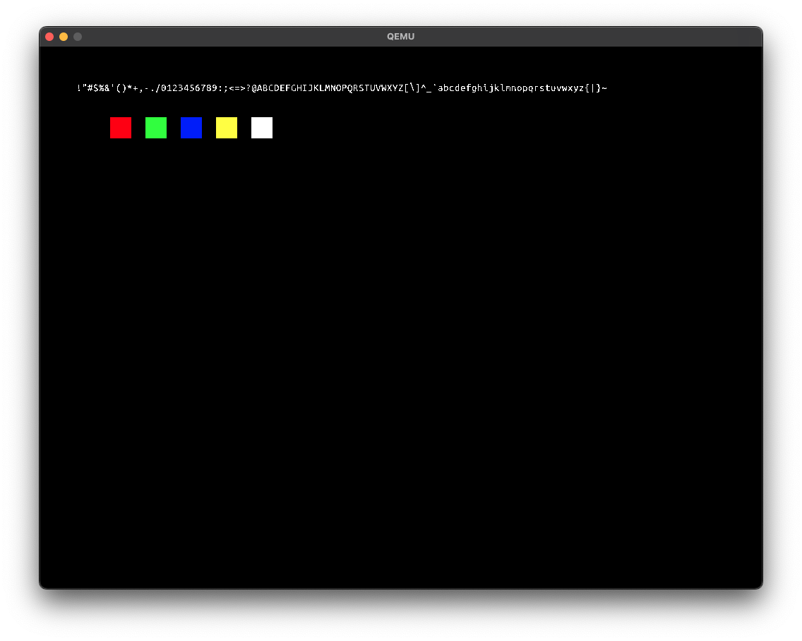

# Feather OS

 Hobby x86-64 bit operating system with the purpose to learn about how an operating system work, especially a kernel work, and more.

## Tech stack

* Compiler g++
* Language: ASM, C, C++
* Build system: CMAKE
* Bootloader: [Limine](https://github.com/limine-bootloader/limine)
* Emulator: QEMU

## Development

1. Clone the project
   `git clone https://github.com/marksinkovics/FeatherOS.git`
2. Build the project with all components
   `./build.sh all`
   In the case of successful build the script will run the build kernel in QEMU
3. Run the built kernel in QEMU
   `./build.sh run`

## Screenshot

